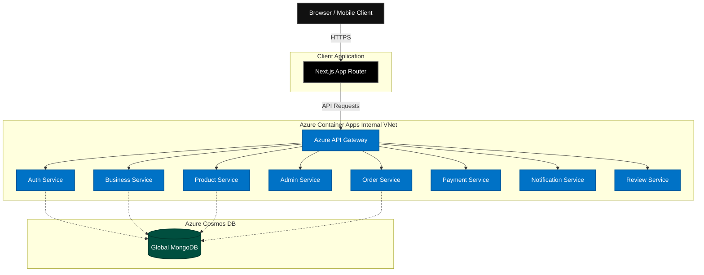

<div align="center">
  <h1>NexusCart E-Commerce Platform</h1>
  <p><strong>A Modern, Enterprise-Grade Microservices Monorepo</strong></p>
  <p>
    <a href="https://github.com/ChamathDilshanC/NexusCart-Microservices-Frontend"></a>
    <a href="https://github.com/ChamathDilshanC/NexusCart-Microservices-Backend"></a>
    <a href="https://azure.microsoft.com/"></a>
  </p>
</div>

<br />

Welcome to the overarching workspace for the **NexusCart Platform**. NexusCart is a highly scalable, decoupled e-commerce solution engineered to handle high-traffic merchant stores and consumer shopping experiences. 

This repository serves as the **Monorepo Workspace** that binds together the independent Frontend and Backend subsystems using Git Submodules, providing developers with a unified view of the entire system architecture.

---

## 🌟 Key Platform Features

- **Multi-Tenant Ready:** Designed to support multiple business vendors and unified consumer storefronts.
- **Glassmorphic UI:** A premium, hyper-modern aesthetic built with Next.js 16 and Tailwind CSS.
- **True Microservices:** Backend decoupled into 8 distinct Node.js services + 1 API Gateway, communicating seamlessly.
- **Cloud-Native Deployment:** Fully dockerized and automatically deployed to Azure Container Apps via GitHub Actions CI/CD.
- **Global NoSQL Data:** Powered by Azure Cosmos DB for MongoDB for extreme scalability and low latency.

---

## 🏗️ System Architecture

NexusCart employs a robust Microservices Architecture pattern. The frontend strictly communicates with a centralized API Gateway, which handles routing, rate limiting, and forwarding requests to the internal virtual network where the microservices reside.



---

## 📦 Repository Structure (Git Submodules)

This monorepo utilizes Git Submodules to maintain strict version separation while allowing full-stack local development.

| Component | Path | Tech Stack | Description |
| :--- | :--- | :--- | :--- |
| **Frontend** | [`/frontend`](./frontend) | Next.js 16, React, Tailwind, TS | The consumer-facing shopping application and merchant dashboard. |
| **Backend** | [`/backend`](./backend) | Node.js, Express, Mongoose | The backend monorepo containing all 9 decoupled microservices. |

### 🛠️ The 9 Microservices Breakdown:
1. **API Gateway (`api-gateway`):** The single entry point for all frontend requests.
2. **Auth Service (`auth-service`):** JWT generation, OTP email verification, and identity management.
3. **Business Service (`business-service`):** Merchant onboarding and vendor profiles.
4. **Product Service (`product-service`):** Catalog management, inventory tracking, and search.
5. **Admin Service (`admin-service`):** Super-admin controls and platform analytics.
6. **Order Service (`order-service`):** Checkout flow, cart state, and order lifecycle management.
7. **Payment Service (`payment-service`):** Secure transaction processing and webhook handling.
8. **Notification Service (`notification-service`):** Centralized email and push notification dispatcher.
9. **Review Service (`review-rating-service`):** User reviews, product ratings, and feedback moderation.

---

## 🚀 Getting Started

To run the entire NexusCart platform locally on your machine, follow these steps:

### 1. Clone the Monorepo (Important!)
Because this repository relies on Git Submodules, you **must** include the `--recurse-submodules` flag when cloning:

```bash
git clone --recurse-submodules https://github.com/ChamathDilshanC/NexusCart-Microservices-Monorepo.git
cd NexusCart-Microservices-Monorepo
```

*(If you already cloned it normally, you can fetch the submodules manually by running: `git submodule update --init --recursive`)*

### 2. Configure Environment Variables
You will need to set up local `.env` files for both the frontend and the backend.

- **Frontend:** `cd frontend && cp .env.example .env.local`
- **Backend:** `cd backend && cp .env.example .env` (Ensure your local MongoDB URI is set)

### 3. Start the Backend Infrastructure
The backend uses Docker Compose or local Node runners. Please refer to the [Backend README](./backend/README.md) for detailed instructions on launching the API Gateway and microservices.

### 4. Start the Frontend Application
Once the API Gateway is running on `http://localhost:5000`:
```bash
cd frontend
npm install
npm run dev
```
Visit `http://localhost:3000` to view the application!

---

## ☁️ Cloud Deployment (CI/CD)

The entire platform is fully automated and deployed to **Microsoft Azure**.

- Every `git push` to the backend repository triggers a **GitHub Actions** workflow that builds 9 separate Docker images in parallel, pushes them to Azure Container Registry (ACR), and executes zero-downtime rolling updates to Azure Container Apps.
- Secrets (like `MONGODB_URI` and `JWT_SECRET`) are securely injected via Azure Key Vault integration at runtime.

---

## 📄 License
This project is proprietary and confidential. Unauthorized copying of these files, via any medium, is strictly prohibited.
