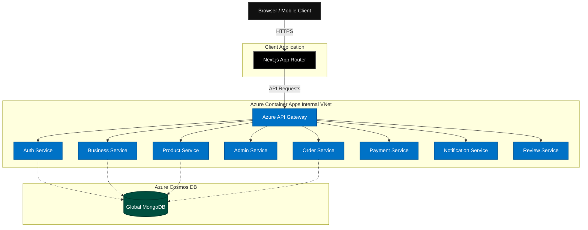

<div align="center">
  <h1>NexusCart E-Commerce Platform</h1>
  <p><strong>A Modern, Enterprise-Grade Microservices Monorepo</strong></p>
  <p>
    <a href="https://github.com/ChamathDilshanC/NexusCart-Microservices-Frontend"></a>
    <a href="https://github.com/ChamathDilshanC/NexusCart-Microservices-Backend"></a>
    <a href="https://azure.microsoft.com/"></a>
  </p>
</div>

<br />

Welcome to the overarching workspace for the **NexusCart Platform**. NexusCart is a highly scalable, decoupled e-commerce solution engineered to handle high-traffic merchant stores and consumer shopping experiences. 

This repository serves as the **Monorepo Workspace** that binds together the independent Frontend and Backend subsystems using Git Submodules, providing developers with a unified view of the entire system architecture.

---

## 🌟 Comprehensive Platform Features

NexusCart is built from the ground up to support multiple vendors, massive product catalogs, and seamless consumer experiences.

### For Customers
- **Seamless Authentication:** Secure JWT-based login with dynamic Email OTP verifications.
- **Smart Catalog & Search:** Lightning-fast product discovery with intelligent filtering.
- **Real-time Cart & Checkout:** Persistent carts across devices with a streamlined, multi-step secure checkout process.
- **Order Tracking:** Live status updates for active orders and comprehensive order history.
- **Reviews & Ratings:** Authenticated purchasing verification to ensure reviews are from real buyers.

### For Merchants (Vendors)
- **Vendor Onboarding:** Automated business registration and verification workflows.
- **Inventory Management:** Dashboard to create, edit, and track product stock in real-time.
- **Analytics & Sales:** Deep insights into store performance, popular products, and revenue.
- **Order Fulfillment:** Merchant tools to update shipping statuses and print invoices.

### For Platform Admins
- **Global Moderation:** Super-admin controls to suspend businesses, moderate reviews, and oversee platform health.
- **Centralized Logs:** Access to notification logs and gateway analytics.

---

## 🏗️ System Architecture

NexusCart employs a robust, event-driven Microservices Architecture pattern. The frontend strictly communicates with a centralized API Gateway, which handles routing, rate limiting, and forwarding requests to the internal virtual network where the microservices reside.



---

## 📦 Repository Structure (Git Submodules)

This monorepo utilizes Git Submodules to maintain strict version separation while allowing full-stack local development.

| Component | Path | Tech Stack | Description |
| :--- | :--- | :--- | :--- |
| **Frontend** | [`/frontend`](./frontend) | Next.js 16, React, Tailwind, TS | The consumer-facing shopping application and merchant dashboard. |
| **Backend** | [`/backend`](./backend) | Node.js, Express, Mongoose | The backend monorepo containing all 9 decoupled microservices. |

---

## 🛠️ Deep Dive: The 9 Microservices

In order to guarantee zero single points of failure and independent scalability, the NexusCart backend is split into 9 distinct Node.js Express applications.

### 1. API Gateway (`api-gateway`)
- **Role:** The sole public-facing entry point for the backend.
- **Responsibilities:** Request routing, CORS configuration, global rate limiting, and centralized error handling. It proxies traffic to the internal microservices based on URL paths.

### 2. Auth Service (`auth-service`)
- **Role:** Identity Provider & Access Management.
- **Responsibilities:** 
  - Handles User Registration and Login.
  - Generates secure JWT access tokens.
  - Manages the Email OTP (One-Time Password) flow using Nodemailer.
  - Stores user credentials and profile data in Cosmos DB.

### 3. Business Service (`business-service`)
- **Role:** Merchant & Vendor Operations.
- **Responsibilities:** 
  - Onboards new merchants and upgrades standard users to Business accounts.
  - Stores vendor store configurations, policies, and payout details.
  - Tracks store-level analytics and performance.

### 4. Product Service (`product-service`)
- **Role:** Catalog & Inventory Core.
- **Responsibilities:** 
  - Exposes powerful CRUD endpoints for merchants to manage their products.
  - Handles image metadata, variant logic (colors, sizes), and dynamic pricing.
  - Supports advanced full-text search, filtering by categories, and pagination.

### 5. Order Service (`order-service`)
- **Role:** Transaction & Fulfillment Lifecycle.
- **Responsibilities:** 
  - Converts User Carts into formal Orders.
  - Tracks order statuses (`PENDING`, `SHIPPED`, `DELIVERED`).
  - Adjusts inventory counts by securely communicating with the Product Service.

### 6. Payment Service (`payment-service`)
- **Role:** Secure Financial Gateway.
- **Responsibilities:** 
  - Integrates with third-party payment processors (Stripe/PayPal).
  - Handles incoming webhooks to securely finalize transactions without exposing business logic.
  - Ensures compliance and logs payment states.

### 7. Notification Service (`notification-service`)
- **Role:** Multi-Channel Communication.
- **Responsibilities:** 
  - A decoupled worker service that listens for internal events (e.g., "Order Placed", "Shipped").
  - Dispatches Email and Push notifications to consumers automatically.

### 8. Review & Rating Service (`review-rating-service`)
- **Role:** Social Proof & Moderation.
- **Responsibilities:** 
  - Allows verified buyers to leave reviews on products and businesses.
  - Calculates average aggregate ratings in real-time.
  - Supports flagging reviews for admin moderation.

### 9. Admin Service (`admin-service`)
- **Role:** Super-Admin Operations.
- **Responsibilities:** 
  - Provides highly privileged endpoints to suspend users or businesses.
  - Grants visibility into platform-wide metrics (total revenue, active users).

---

## 🚀 Getting Started

To run the entire NexusCart platform locally on your machine, follow these steps:

### 1. Clone the Monorepo (Important!)
Because this repository relies on Git Submodules, you **must** include the `--recurse-submodules` flag when cloning:

```bash
git clone --recurse-submodules https://github.com/ChamathDilshanC/NexusCart-Microservices-Monorepo.git
cd NexusCart-Microservices-Monorepo
```

*(If you already cloned it normally, you can fetch the submodules manually by running: `git submodule update --init --recursive`)*

### 2. Configure Environment Variables
You will need to set up local `.env` files for both the frontend and the backend.

- **Frontend:** `cd frontend && cp .env.example .env.local`
- **Backend:** `cd backend && cp .env.example .env` (Ensure your local MongoDB URI is set)

### 3. Start the Backend Infrastructure
The backend uses Docker Compose or local Node runners. Please refer to the [Backend README](./backend/README.md) for detailed instructions on launching the API Gateway and microservices.

### 4. Start the Frontend Application
Once the API Gateway is running on `http://localhost:5000`:
```bash
cd frontend
npm install
npm run dev
```
Visit `http://localhost:3000` to view the application!

---

## ☁️ Cloud Deployment (CI/CD)

The entire platform is fully automated and deployed to **Microsoft Azure**.

- Every `git push` to the backend repository triggers a **GitHub Actions** workflow that builds 9 separate Docker images in parallel, pushes them to Azure Container Registry (ACR), and executes zero-downtime rolling updates to Azure Container Apps.
- Secrets (like `MONGODB_URI` and `JWT_SECRET`) are securely injected via Azure Key Vault integration at runtime.

---

## 📄 License
This project is proprietary and confidential. Unauthorized copying of these files, via any medium, is strictly prohibited.
