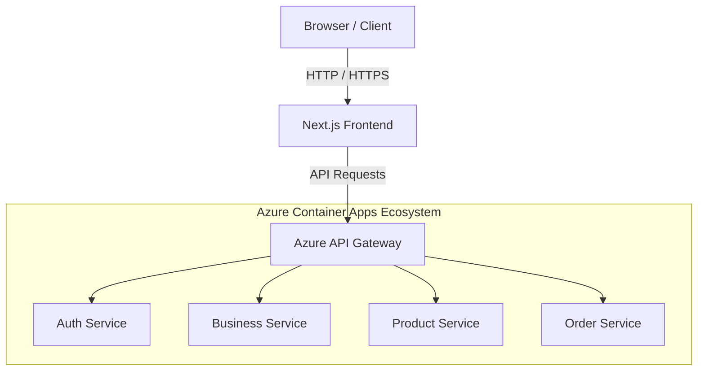

# NexusCart E-Commerce Platform

Welcome to the **NexusCart** monorepo workspace! This is the parent repository that houses both the Frontend and Backend components of the NexusCart e-commerce platform.

## 🏗️ Architecture Overview

NexusCart is built using a modern decoupled architecture:

- **Frontend:** A high-performance, glassmorphic client application built with Next.js 16, Tailwind CSS, and TypeScript.
- **Backend:** A robust, scalable microservices architecture deployed on Azure Container Apps, built with Node.js, Express, and MongoDB.



## 📦 Repository Structure

This repository uses **Git Submodules** to manage the frontend and backend as independent repositories while keeping them logically grouped together here.

- [`/frontend`](./frontend): The Next.js frontend application.
- [`/backend`](./backend): The Azure Microservices backend.

## 🚀 Getting Started

When cloning this repository, make sure to pull the submodules as well:

```bash
git clone --recurse-submodules <this-repo-url>
```

If you already cloned it without the `--recurse-submodules` flag, you can initialize them with:

```bash
git submodule update --init --recursive
```

Please refer to the `README.md` files inside the `/frontend` and `/backend` directories for specific instructions on how to run them locally.
