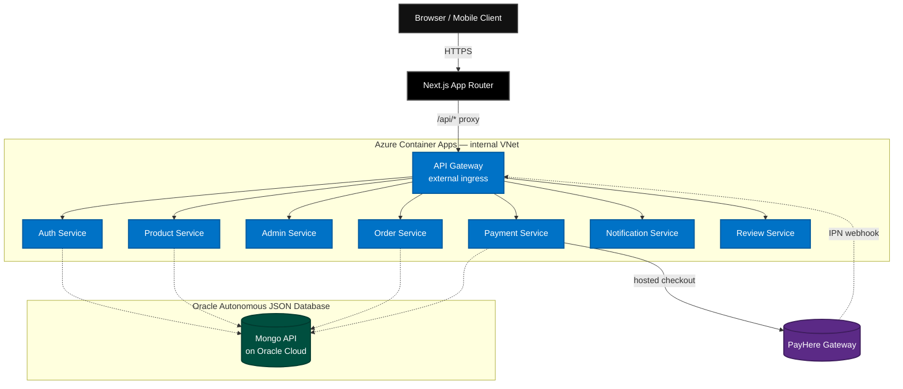

<div align="center">
  <h1>NexusCart E-Commerce Platform</h1>
  <p><strong>A Modern, Enterprise-Grade Microservices Monorepo</strong></p>
  <p>
    <a href="https://github.com/ChamathDilshanC/NexusCart-Microservices-Frontend"></a>
    <a href="https://github.com/ChamathDilshanC/NexusCart-Microservices-Backend"></a>
    <a href="https://azure.microsoft.com/"></a>
  </p>
  <p>
    
    
    
    
  </p>
</div>

<br />

Welcome to the overarching workspace for the **NexusCart Platform** — a full e-commerce system built as 9 independent backend microservices plus a Next.js storefront/admin console, engineered around real production concerns: atomic stock control, role-based admin access, a signed payment-gateway integration, and multi-currency support.

This repository is the **Monorepo Workspace** that binds the independent [Frontend](https://github.com/ChamathDilshanC/NexusCart-Microservices-Frontend) and [Backend](https://github.com/ChamathDilshanC/NexusCart-Microservices-Backend) repos together via Git Submodules, giving a single, versioned view of the whole system.

---

## 🌟 Platform Features

### For Customers
- **Flexible auth** — email/password with OTP verification, or Google one-tap login.
- **Templated storefront** — the shop and its banners are built from 7–8 configurable layouts (carousel, grid, spotlight, bento, showcase, marquee, cinematic...), each independently positioned by an admin — not hardcoded page sections.
- **Multi-currency** — live exchange rates, switch currency anywhere, prices stay consistent across cart/checkout/invoices.
- **Real payments** — checkout redirects to **PayHere's** hosted, MD5-signed payment page for card/wallet, or Cash on Delivery with no gateway involved.
- **Order tracking & invoices** — paginated order history with live status polling, printable itemized invoices, and status-change emails.
- **Reviews & ratings** on products.

### For Platform Admins
- **Two-layer RBAC** — a `role` (only one super-admin account can ever grant `Admin`) plus independent, per-section `permissions` (`products`, `orders`, `banners`, `promotions`, `settings`) that any admin can grant to another, without needing super-admin status.
- **Inventory control** — stock in/out adjustments with a capped movement history per product, backed by atomic, race-safe updates (never goes negative under concurrent orders).
- **Visual template builder** — compose banners and product rails from the same 7–8 layout system customers see, with live position/order control.
- **Promotions engine** — storewide, per-category, or per-product discounts, auto-applied at the best rate.
- **Live order notifications**, currency/settings management, and full user management.

---

## 🏗️ System Architecture

The frontend talks exclusively to a public API Gateway, which proxies to internal-only microservices inside Azure's virtual network. Payments are the one place a customer's browser leaves NexusCart entirely — PayHere's IPN webhook then reports back directly to the gateway, server-to-server.



---

## 📦 Repository Structure (Git Submodules)

| Component | Path | Tech Stack | Description |
| :--- | :--- | :--- | :--- |
| **Frontend** | [`/frontend`](./frontend) | Next.js 16, React 19, Tailwind 4, TS | The customer storefront and admin console. |
| **Backend** | [`/backend`](./backend) | Node.js, Express, Mongoose, TS | 9 decoupled microservices behind one API Gateway. |

Each has its own README with full setup instructions and a deeper architectural breakdown — [Frontend README](./frontend/README.md) · [Backend README](./backend/README.md).

---

## 🛠️ The Microservices, at a Glance

| Service | Role |
| :--- | :--- |
| **API Gateway** | Sole public entry point; proxies `/api/*` to every internal service. |
| **Auth Service** | Registration + OTP verification, login, Google OAuth, password reset, JWT issuance. |
| **Product Service** | Catalog, categories, banners/promotions, currency & exchange rates, atomic stock control, the banner/product template engine. |
| **Admin Service** | RBAC (role + per-section permissions), user management, platform metrics, authenticated proxy to Product/Order writes. |
| **Order Service** | Cart → order conversion, server-computed totals, status lifecycle, internal payment-status endpoint. |
| **Payment Service** | Real PayHere integration — signed hosted checkout + IPN webhook verification. |
| **Notification Service** | Dispatches transactional email (order confirmation, status changes) via Brevo. |
| **Review & Rating Service** | Product reviews and star ratings. |
| **Business Service** 🚧 | Multi-vendor storefront scaffold — not yet wired into the live platform (see [Roadmap](#-roadmap)). |

Full responsibilities, request flows, and a payment sequence diagram are in the [Backend README](./backend/README.md#️-deep-dive-the-microservices).

---

## 🚀 Getting Started

### 1. Clone with submodules
```bash
git clone --recurse-submodules https://github.com/ChamathDilshanC/NexusCart-Microservices-Monorepo.git
cd NexusCart-Microservices-Monorepo
```
*(Already cloned without it? Run `git submodule update --init --recursive`.)*

### 2. Configure environment
- **Backend:** `cd backend && cp .env.example .env` — see the [Backend README](./backend/README.md#-quick-start-local-development) for what each variable does.
- **Frontend:** `cd frontend && cp .env.example .env.local`

### 3. Start the backend
```bash
cd backend
npm install && npm run install:all
npm run dev
```
This spins up the API Gateway (`:5000`) and all microservices concurrently — visit `http://localhost:5000` for a live, browsable route index.

### 4. Start the frontend
```bash
cd frontend
npm install
npm run dev
```
Visit `http://localhost:3000`.

---

## ☁️ Cloud Deployment (CI/CD)

- **Compute:** Microsoft Azure Container Apps — every backend service is its own container, the API Gateway is the only one with external ingress.
- **CI/CD:** every push to the backend's `main` triggers a path-filtered GitHub Actions workflow — only services whose files actually changed get rebuilt, pushed to Azure Container Registry, and rolled out, each verified healthy post-deploy.
- **Frontend:** deploys to Vercel automatically on push to `main`.
- **Database:** Oracle Autonomous JSON Database (Always Free tier) via the Oracle Database API for MongoDB — Mongoose connects to it unchanged. It replaced Azure Cosmos DB to cut hosting cost; see [`docs/OCI_MIGRATION.md`](./docs/OCI_MIGRATION.md) for the migration runbook.
- **Payments:** PayHere, Sri Lanka's Central-Bank-approved gateway — Sandbox mode for testing, a one-line env flag to go live.
- **Secrets** (`JWT_SECRET`, `PAYHERE_MERCHANT_SECRET`, etc.) are set directly as Azure Container Apps environment variables per service, not synced from CI on every deploy.

---

## 🗺️ Roadmap

- **Multi-vendor marketplace** — wire up `business-service`: add a `Vendor` role, proxy it through the API Gateway, and connect merchant storefronts to the catalog.
- **Payment-receipt email** — route the `PAYMENT_SUCCESS` event to its own template (today the order-status-change email already covers the PAID transition).
- Real image hosting for admin-uploaded product images (currently base64-encoded, which some email clients strip).

---

## 📄 License
This project is proprietary and confidential. Unauthorized copying of these files, via any medium, is strictly prohibited.
